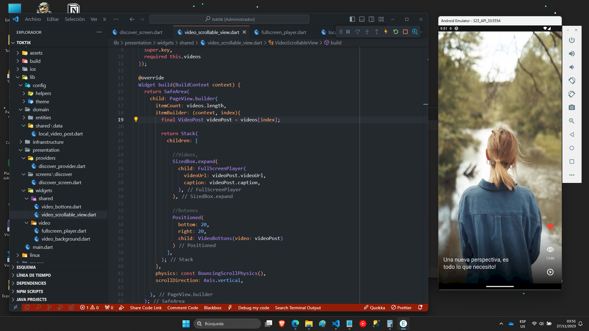

# toktik

## Descripción General

Toktik, una aplicación Flutter de reproductor vertical al estilo TikTok, destaca por:

- Manejo de assets
- Uso de paquetes
- Gesture Detector
- Posicionamiento de Widgets
- Mappers
- Gradientes
- Loops
- Aserciones
- Stacks
- Controladores de video

## Implementación de Repositorios y Datasources

En lugar de ser un próximo paso, Toktik ya implementa repositorios y datasources, permitiendo cambiar dinámicamente las fuentes de datos sin alterar el flujo de la aplicación.

### Repositorios

Los repositorios actúan como intermediarios para acceder a los datasources. En Toktik, representan las aulas de clase, donde cada "aula" (repositorio) gestiona la obtención de datos de diferentes "profesores" (datasources).

### Datasources

Los datasources son los orígenes de datos. En Toktik, cada "profesor" sigue los lineamientos para proporcionar datos específicos. Esta implementación facilita la flexibilidad al cambiar dinámicamente las fuentes de datos sin afectar la lógica principal de la aplicación.

## Imagenes

